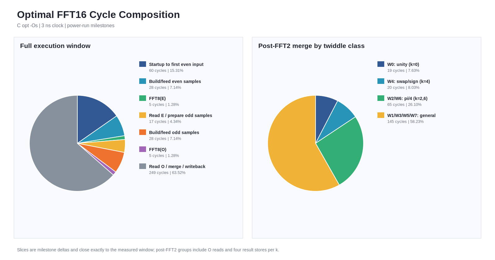
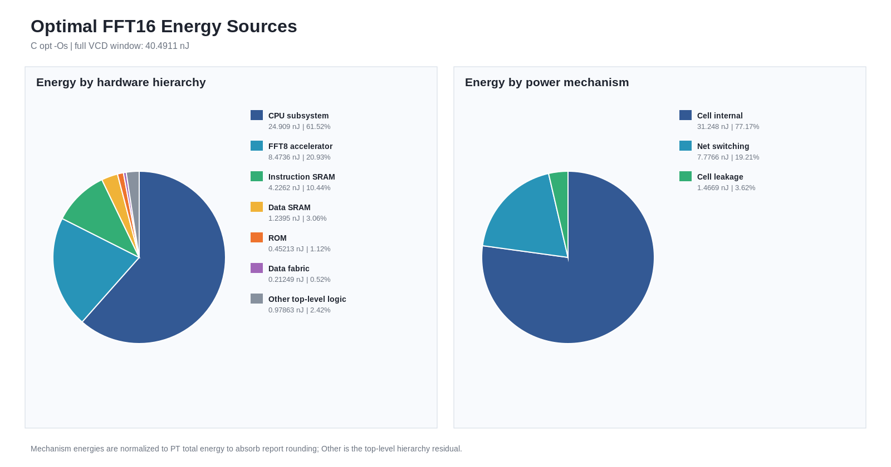

# FFT16 软件优化结果

生成时间：2026-09-11T12:43:06Z

时钟周期：3 ns。汇编基线来自扫描点 `f333p333333_w430p72_h560`，未在本次脚本中重跑。

本次物理工件指纹：`df1806656fd38a9204a5fe613bb7b7d7b94c97ba10b89c49255fddccf153fb9b`。

| 版本 | 状态 | 编译 | 镜像(B) | 拍数 | 时间(ns) | 系统性能(point/s) | 功耗(mW) | 窗口能量(nJ) | 计算能效(point/J) | 加速比 |
|---|:---:|:---:|---:|---:|---:|---:|---:|---:|---:|---:|
| ASM legacy | LEGACY | manual |  | 506 | 1518 | 1.05402e+07 | 34.3 | 52.1226 | 3.06968e+08 | 1 |
| C ref -O0 | PASS | O0 | 1340 | 3128 | 9384 | 1.70503e+06 | 34.1 | 320.148 | 4.99769e+07 | 0.161765 |
| C ref -Os | PASS | Os | 760 | 663 | 1989 | 8.04424e+06 | 33.3 | 66.3835 | 2.41024e+08 | 0.763198 |
| C opt -Os | PASS | Os | 1032 | 392 | 1176 | 1.36054e+07 | 34.3 | 40.4911 | 3.95148e+08 | 1.29082 |

## 口径

- CPU 完成时间 = 实测拍数 × 3 ns。
- 系统性能 = 16 ÷ CPU 完成一次 16 点 FFT 的时间，单位 point/s。
- VCD 窗口能量 = PT 时域平均 SoC 功率 × 实际 VCD 窗口时间。
- 计算能效 = 16 ÷ VCD 窗口 SoC 总能量，单位 point/J。

## 汇编基线瓶颈与重叠上限

- 末次 FFT8 完成后的软件合并/写回为 351/506 拍（69.4%）。
- 两次 FFT8 等待合计 8 拍（1.6%），并非主要周期来源。
- 仅将两次 FFT8 执行完美重叠，理论上从 506 降到 502 拍：减少 0.79%，加速 1.008×。
- 若连两段硬件等待都被其他软件工作完全隐藏，绝对上限为 498 拍：减少 1.58%，加速 1.016×。

## 当前最优方案周期细分

以下数据来自与功耗 VCD 同一次门级仿真，方案为 `C opt -Os`。

| 阶段 | 周期 | 占完整计算窗口 |
|---|---:|---:|
| 启动至首个偶序列输入 | 60 | 15.31% |
| 构造并送入偶序列 | 28 | 7.14% |
| 第一次 FFT8：E | 5 | 1.28% |
| 读取 E 并准备奇序列 | 17 | 4.34% |
| 构造并送入奇序列 | 28 | 7.14% |
| 第二次 FFT8：O | 5 | 1.28% |
| 读取 O、旋转合并与写回 | 249 | 63.52% |

FFT2 完成后的读取、旋转、蝶形合并和写回继续按旋转类型细分：

| 旋转类型 | 周期 | 占 FFT2 后阶段 |
|---|---:|---:|
| W0：单位旋转（k=0） | 19 | 7.63% |
| W4：交换/取反（k=4） | 20 | 8.03% |
| W2/W6：±π/4（k=2,6） | 65 | 26.10% |
| W1/W3/W5/W7：通用旋转 | 145 | 58.23% |

## 当前最优方案能耗来源

模块能量由同一完整执行窗内的层次平均功耗乘以窗口时长得到；各模块是互斥的 SoC 顶层分支。

| 硬件来源 | 平均功耗 (mW) | 能量 (nJ) | 占比 |
|---|---:|---:|---:|
| CPU 子系统 | 21.1 | 24.9086 | 61.52% |
| FFT8 加速器 | 7.178 | 8.47363 | 20.93% |
| 指令 SRAM | 3.58 | 4.22619 | 10.44% |
| 数据 SRAM | 1.05 | 1.23952 | 3.06% |
| ROM | 0.383 | 0.452132 | 1.12% |
| 数据总线 | 0.18 | 0.21249 | 0.52% |
| 其他顶层逻辑 | 0.829 | 0.978634 | 2.42% |

| 功耗类型 | PT 平均功耗 (mW) | 分配能量 (nJ) | 占比 |
|---|---:|---:|---:|
| 单元内部 | 26.5 | 31.2477 | 77.17% |
| 网络翻转 | 6.595 | 7.77656 | 19.21% |
| 单元漏电 | 1.244 | 1.46687 | 3.62% |

Internal/switching/leakage 的 PT 文本功耗存在末位舍入；表中分配能量保留三者相对权重并归一到 40.4911 nJ 的窗口总能量。
`Other top-level logic` 为 SoC 总功耗扣除已列顶层模块后的残差，主要覆盖顶层时钟与胶合逻辑。

