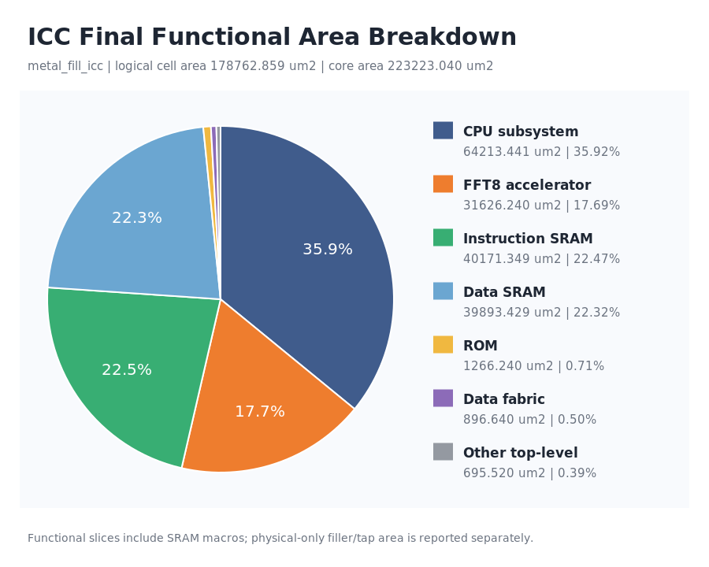
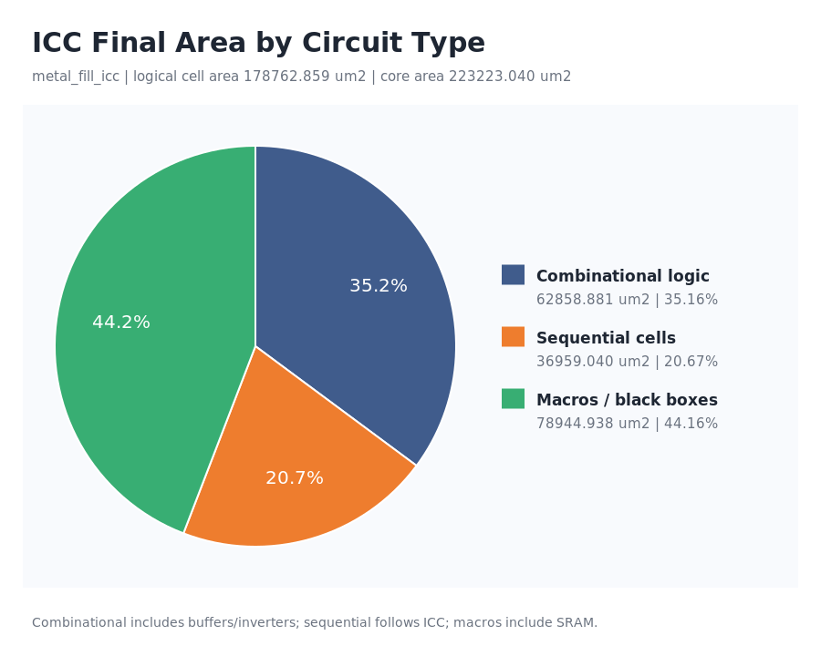
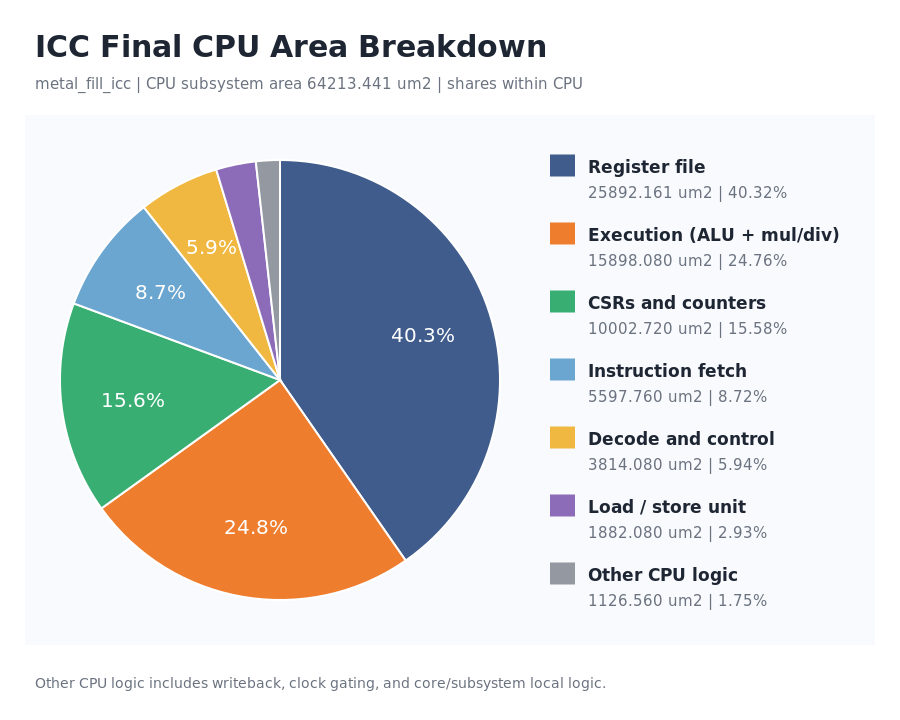

# ICC 最终系统面积构成

来源：只读重新打开 `metal_fill_icc` CEL 后生成的层次面积报告。

| 指标 | 面积/数值 |
|---|---:|
| 两种分类的共同分母（normal/logical cell area，含 SRAM 宏） | 178762.859 µm² |
| ICC Design Area | 178762.859 µm² |
| Physical-only cell area | 25773.12 µm² |
| Total leaf cell area | 204535.98 µm² |
| Core area | 223223.04 µm² |
| Cell utilization (non-fixed) | 81.25% |

| 功能模块 | ICC 层次 | 面积 (µm²) | 占逻辑单元面积 |
|---|---|---:|---:|
| CPU 子系统 | `x_sub_system` | 64213.4409 | 35.92% |
| FFT8 加速器 | `u_fft8_top` | 31626.2401 | 17.69% |
| 指令 SRAM | `x_isram_ahbl` | 40171.3488 | 22.47% |
| 数据 SRAM | `x_data_sram` | 39893.4288 | 22.32% |
| ROM | `x_rom_ahbl` | 1266.24 | 0.71% |
| 数据总线 | `x_data_fabric` | 896.64 | 0.50% |
| 其他顶层逻辑 | `<top-level residual>` | 695.519911 | 0.39% |

## 按电路性质划分

| 电路性质 | 面积 (µm²) | 占逻辑单元面积 |
|---|---:|---:|
| 组合逻辑 | 62858.8806 | 35.16% |
| 时序单元（寄存器、锁存器等） | 36959.0404 | 20.67% |
| 宏/黑盒单元（含 SRAM） | 78944.9375 | 44.16% |

## CPU 内部面积分解

分母为 CPU 子系统 `x_sub_system` 的面积：64213.4409 µm²。

| CPU 内部模块 | 面积 (µm²) | 占 CPU 子系统面积 |
|---|---:|---:|
| 通用寄存器堆 | 25892.1606 | 40.32% |
| 执行单元（ALU、乘除法等） | 15898.0801 | 24.76% |
| CSR 与计数器 | 10002.7201 | 15.58% |
| 取指单元 | 5597.76 | 8.72% |
| 译码与控制 | 3814.08 | 5.94% |
| 访存单元 | 1882.08 | 2.93% |
| 其他 CPU 逻辑 | 1126.5601 | 1.75% |

执行单元包含 ALU、乘除法及其局部逻辑；CSR 包含内部计数器；取指包含预取缓存等子模块。各项取全局面积，不重复累加其后代。
“其他 CPU 逻辑”是 CPU 子系统总面积减去六个命名模块，包含写回、时钟门控、核心局部逻辑及子系统外围逻辑。

## 统计口径

- 六个命名模块取 `report_area -hierarchy` 的顶层全局面积，彼此互斥。
- “其他顶层逻辑”为总逻辑单元面积扣除六个命名模块后的残差，包含顶层时钟和胶合逻辑。
- SRAM 宏面积归入对应 SRAM；filler、tap 等 physical-only 单元不能按逻辑层次归属，因此不进入饼图。
- 电路性质直接取同一份 ICC 报告的 `Combinational area`、`Noncombinational area` 和 `Macro/Black Box area`。
- 组合逻辑包含缓冲器/反相器，不能再加一次 `Buf/Inv area`；时序单元按 ICC 的非组合分类统计，不能解释为仅有寄存器。
- SRAM 在电路性质图中属于宏/黑盒单元；ROM 按其实际映射的组合、时序或宏单元归类，不按模块名称推断。
- 两种分类分别与同一个总面积核对，并与 QoR 和 physical summary 交叉检查；允许报告舍入误差（max(0.1 µm², 总面积 × 10⁻⁶)）。
- Core area 是版图边界占地，不是饼图各项之和。
